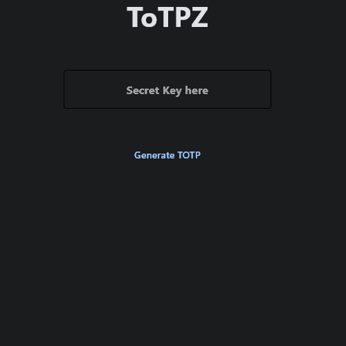

# ToTPZ - Time-Based One-Time Password Generator for Windows

A lightweight, one-file(no installation required) Windows application for easily generating Time-Based One-Time Password (TOTP) codes using your secret keys.

## Features

- Paste your secret key into the designated field.
- Click the "Generate ToTP" button to generate your TOTP code.
- Copy generated code to clipboard.

## Security

- `ToTPZ.exe` does not store any data
- `ToTPZ.exe` does not connect to the internet

## How to Use

1. Download the latest `ToTPZ.exe` file from the [Releases](https://github.com/komtraya/totpz/releases) section.
2. Run the application by double-clicking the executable.
3. Paste your TOTP secret key into the designated field.
4. Click the "Generate ToTP" button.
5. Your TOTP code will be displayed.
6. Use the generated code for two-factor authentication.

## Usage Example

You can store your secret keys in a password manager like Bitwarden(free), and use this app to generate the codes you need when required.

## Acknowledgments

- TOTP algorithm from [pyotp](https://github.com/pyauth/pyotp)
- UI: [flet](https://github.com/flet-dev/flet)
